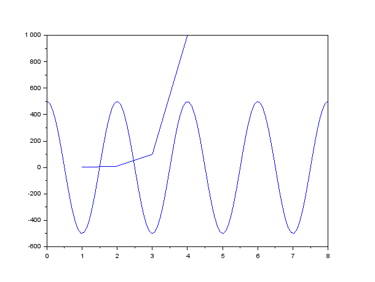

= Engineering Tools

== Overview
This is a list of tools I was able to list in short order.  Please note that this in not complete as new tools are created all the time and I may have missed helpful tools in my haste.

[[OVERVIEW_TAB]]
.Tools by Function 
[%autowidth]
|===
|Function |Tool

.14+|Text Editors | <<notepad_pp>>

|<<kate>>

|<<gedit>>

|<<nano>>

|<<vi>>

|<<eclipse>>

|<<vscode>>

|<<dvt>>

|<<sigassi>>

|<<spyder>>

|<<arduino>>

|<<asciidoc>>

|<<sed_awk>>

|<<grep>>

.6+|Graphic Tools |<<draw_io>>

|<<wavedrom>>

|<<gimp>>

|<<inkscape>>

|<<autocad_fusion>>

|<<cura>>

.2+|Source Control |<<git>>

|<<svn>>

.2+|Text Compare tools |<<kdiff3>>

|<<meld>>

.3+|Math Tools |<<matlab>>

|<<scilab>>

|<<wolframalpha>>

.5+|Programming Languages |<<python>>

|<<cpp>>

|<<ruby>>

|<<tcl>>

|<<bash>>

.5+|Communication Tools|<<ssh>>

|<<vnc>>

|<<putty>>

|<<minicom>>

|<<rdp>>

|Circuit Design |<<kicad>>

.6+|FPGA Tools | <<excelium>>

|<<modelsim>>

|<<aldec>>

|<<synplfy>>

|<<vivado>>

|<<libero>>

|Audio Tools | <<audacity>>

.3+|Virtualization |<<virtualbox>>

|<<docker>>

|<<WSL>>

.2+|Operating Systems|<<windows>>

|<<ubuntu>>

|===

== Text Editors

[[notepad_pp, Notepad++]]
=== Notepad++
This is a windows based text editor with some nice features like:
* Code Highlighting (color coded text based on type of file)
* Block mode selection
* Enhanced search and replace
* Macro record and palyback

https://notepad-plus-plus.org/downloads/

[[kate, Kate]]
=== Kate
Linux graphical text editor with enhaced features like <<notepad_pp>>.  

https://kate-editor.org/

[[gedit, Gedit]]
=== Gedit
Linux graphical text editor.  This supports basic features.  

https://wiki.gnome.org/Apps/Gedit

[[nano, Nano]]
=== Nano
Linux terminal text editor.  This editor is an easy to use basic text editor.  This can be used when a graphical envoronment is nat available, and is simple and intiutive to use.  You navigate your text file with the arrow keys, when you are ready to save type [CTRL-O], to exit type [CTRL-X].

https://www.nano-editor.org/

[[vi, vi, vim, or gvim]]
=== vi, vim, or gvim
Linux terminal and graphical text editor.  This is a very full featured text editor that has a complex interface.  There are two modes to the environment: command and insert.  Insert mode is entered on a few commands, to exit insert mode and return to command mode use the [ESC] key.  If you find yourself in a vi type environment the following commands will help:

* :w - Write to disk
* :wq - Write and exit
* :q! - Exit NOW without writing
* :i Insert text (change to inster mode)
* :set nu - Turn on lin numbers

For more look here: https://web.mit.edu/merolish/Public/vi-ref.pdf

https://www.vim.org/

[[eclipse, Eclipse]]
=== Eclipse
Eclipse it a open source development environment that is used be many software disciplines. This integrated environment allows ful software development including lint (syntax checking) and compiling.  There are many language specific sperspectives that streamline the environment for specific tasks.  Eclipse uses a workbench that contains projects.  This allows you to organize your source files in an easy to use format.  Each project defines how the code will be processed.  This allows you to create an environmnet that know how to build you project and can present a debug view of your code.  https://www.eclipse.org/ide/

https://www.eclipse.org/home/

[[vscode, Visual Studio Code]]
=== Visual Studio Code
Visual Studio is a free IDE from Microsoft for software development similar to <<eclipse>>.  

https://visualstudio.microsoft.com/

[[dvt, DVT]]
=== DVT
DVT is a plug in for Eclipse that allows enhanced support for FPGA languages.  Code completion, highlighting, find declaration, and live syntax checking tools provide much help during developmnet.

[[sigassi, Sigassi]]
=== Sigassi
Sigassi is a tool like <<dvt>> for FPGA development.

[[spyder, Spyder IDE]]
=== Spyder IDE
Spyder IDE is a python IDE that helps when develping a Python program.  It has a code editor, python terminal window, a variable viewer and a debugger.  This is included with an Anaconda install.

https://www.spyder-ide.org/

[[arduino, Arduino IDE]]
=== Arduino IDE
Simple code editor for microcontrollers.
Arduino is a free IDE that works with simple microcontrollers. This is an open source project that was designed to make using microcontrollers easy for gradeschoolers.  Because of this we have a powerfull tool that is very easy to use.  Arduino uses a simplified version of c that has two basic functions: setup() and loop() in every sketch.

There is support for most microntrollers and the examples library has almost any type of sensor or device your would want to use.  This is a great way to see something work before incorporating it in your design.  

Code available for most sensors actuators
Arduino uses two functions in every program: setup and loop. Setup is run once at the start. Loop runs over and over again after setup is complete.

Here is a simple example program:

[source, c]
----

// the setup function runs once when you press reset or power the board
void setup() {
  // initialize digital pin LED_BUILTIN as an output.
  pinMode(LED_BUILTIN, OUTPUT);
}

// the loop function runs over and over again forever
void loop() {
  digitalWrite(LED_BUILTIN, HIGH);   // turn the LED on (HIGH is the voltage level)
  delay(1000);                       // wait for a second
  digitalWrite(LED_BUILTIN, LOW);    // turn the LED off by making the voltage LOW
  delay(1000);                       // wait for a second
}
----
Here you can see how the setup function sets the pin mode once and the loop function turns on and off the output with a 1 second delay.  This example was copied from the blink example that comes with the environment.  You can find this and many more examples by selecting the *File*-> *Examples* menu choice.

https://www.arduino.cc/

[[asciidoc, AsciiDoctor]]
=== AsciiDoctor
This is the tool I would use to create a doctorate level paper or a dynamic website.  This tool takes human readable text with some easy formatting and created nice looking documents.  Since this is easy to read and create text, I can automate the creation without much pain.  So if you have an automated method to collect experiment data, the report can be populated as data is collected.

I used AsciiDoctor to create this document.  Below is the command run to do that:

[source, shell]
----
asciidoctor -r asciidoctor-pdf -b pdf Engineer_tools.adoc
----

https://asciidoctor.org/

[[sed_awk, Sed and Awk]]
=== Sed and Awk
Sed and Awk are linux command line utilities that have spawned into their own simplified scripting languages.  You can use these tools to modify text documents.  This is use in very clever ways.

https://www.gnu.org/software/sed/manual/sed.html

https://www.gnu.org/software/gawk/manual/gawk.html

[[grep, Grep]]
=== Grep
grep is a tool that will search a file for a "Regular Expression", RE.  An RE is a search pattern protocol that can have advanced attributes.  You can use grep as a find in files by using a * wildcard.  RE are used in many of the text editors and the sed and awk utilities.

Some Useful characters are:

* '^' = Start of line
* '$' = End of line
* '*' = Match preceding RE term 0 or more times
* '+' = Match preceding RE term 1 or more times
* '?' = Match preceding RE term 0 or 1 times
* '{m}' = Match preceding RE term exactly m times
* '[]' = Create a set of characters to match ie. [a-z] will match lowercase letters
* '\' = An escape character to allow proceding special charcters in your search string

https://www.gnu.org/software/grep/manual/grep.html#:~:text=grep%20searches%20the%20named%20input,grep%20searches%20the%20working%20directory%20.

https://www.rexegg.com/regex-quickstart.html

== Graphic Tools 

[[draw_io, DrawIO]]
=== DrawIO
This is a simple tool to use that gives the user the ability to create Visio like block diagrams without costs of an expensive tool.  This tool can be run in a browser or can be downloaded to run on your machine.

.DrawIO Example`
image::drawio_example.png[]

https://www.drawio.com/

[[wavedrom, Wavedrom]]
=== Wavedrom
Wavedrom allow you to create timing diagrams using a simple text protocol.  This is helpful in describing digital interfaces.  This tool can be run in a browser or can be downloaded to run on your machine.

[[source, wavedrom]]
----
{signal: [
  {name: 'clk', wave: 'p.....|...'},
  {name: 'dat', wave: 'x.345x|=.x', data: ['head', 'body', 'tail', 'data']},
  {name: 'req', wave: '0.1..0|1.0'},
  {},
  {name: 'ack', wave: '1.....|01.'}
]}
----

.Wavedorm Example
image::wavedrom_examp.svg[]

https://wavedrom.com/

[[gimp, Gimp]]
=== Gimp
Image editor tool. Gimp is a powerful bitmap editting tool.  This is like a free version of Adobe Photoshop.  I used gimp to generate the screenshots for this document.

https://www.gimp.org/

[[inkscape, Inkscape]]
=== Inkscape

Inkscape is a vector graphic editor.  Vector graphics are image files that can scale.  This is because vector graphic files store directions to make a drawing verses the vause of every pixel (bitmap).  This format was derived from instructions to print a drawing on a plotter.  PDF file format is an example of a vector file.

https://inkscape.org/

[[autocad_fusion, Autocad Fusion 360]]
=== Autocad Fusion 360
Free tool to create 3-D drawings.  This is an extremly powerful tool that can be used to create 3-dimnsional drawings.  You can create 2-D sketches and extrude to make a 3-d object.  This is very useful in creating things to print on a 3-D printer.

Requires a free account to use.

.Autocad Fusion 360 Example
image::autocad_examp.png[]

https://www.autodesk.com/products/fusion-360/overview

[[cura, Cura]]
=== Cura
Open source Slicer tool to create G-code that is needed for 3-D printer.  G-code is a text file that contains commands for a 3-D printer.  This tool converts a drawing ie *.stl file to the commands your printer needs to make it.  This tool should have knowledge of your printer and the material you are printing.  There is an oportunity to tweak settings here to get a better print.

https://ultimaker.com/software/ultimaker-cura/

== Source Control 
[[git, Git]]
=== Git
Source control tools that allow you to go back in time and allow parallel development.  These tools are a lifesaver for projects that last for more than a few weeks. 

Git is the popular tool this week.  For most open source software the code is available in a public git repository.  For simple one person projects you can create a local repo that will provide the time machine function that can save significant work.

To create a local copy of a repo:

[source, git]
----
git clone [repo URL]
----

To add to a repo:

[source, git]
----
git add [filename]
----

To commit to a repo:

[source, git]
----
git commit -m [your commit comment]
----

To publish your commits:

[source, git]
----
git push
----

https://git-scm.com/

[[svn, Subversion]]
=== Subversion

Subversion is similar to git.  

https://subversion.apache.org/

== Compare tools 
[[kdiff3, Kdiff3]]
=== Kdiff3
Kdiff3 is a tool that works in both Windows and Linux.  It is handy to be able to compare two files.  It is key to understand version in a version control system like <<git>> or <<svn>>.  This can help highlight changes to a file after it is copied before any alterations.  This tool also can compare directories.  If you want you can merge the changes in the files together.  This tool lest you go to each difference and decide if you want A, B or a custom change.

https://download.kde.org/stable/kdiff3/?C=M;O=D

https://invent.kde.org/sdk/kdiff3

[[meld, Meld]]
=== Meld
Meld is a gnu open source compare tool with many of the same features as <<kdiff3>>.  

https://gitlab.gnome.org/GNOME/meld/-/tree/main/

== Math Tools 
[[matlab, Matlab]]
=== Matlab
Matlab is an extremely powerful math modeling tool.  It has very nice libraries of advanced functions that can easily be called from a matlab script.  Although Matlab is prohibitavly expensive for me to use outside of work it is available for purchase as a student at a reasonable rate. 

Matlab likes to work on arrays and matrices; where a matrice is a multidimensional array.  The scripts that Matlab likes are called M-Files.  All commands that can be run in the terminal can be used in an M-File scripts.  This combined with normal scripting constructs like conditionals and loops creates a powerful tool.  

Matlab has really good graphing that is easy to create.  This helps tremendously when trying to visualize data.  It also is easy to import and export data to files.  Matlab has Toolboxes that contain advanced functions that can be called from your scripts.

Below is a sample M-File script that demonstrates some of the features in Matlab.

[source, Matlab]
----
%Create Simple array of know values

a = [ 1,10,100,1000]

%Create a 3x3 array

b = [1,2,3; 4,5,6; 7,8,9]

%Create an array of evenly spaced interval

c = linspace(0, 8*3.1415927)

%Create a simple plot 

plot(a)

%Do some fun array math

d = 500*cos(c)
e = c/3.1415927

plot(e,d)

----

https://www.mathworks.com/products/matlab/student.html

[[scilab, SciLab]]
=== SciLab
Scilab is a free Matlab like tool.  This has the same basic functionality as <<matlab>>, but is missing the advance function libraries that are available in <<matlab>>.  So most simple matlab scripts will just run in this tool after a conversion with the mfile2sci(path) command.

Here is the graphix output from the M-File script listed in the <<matlab>> secion.
.SciLab M-file demo graph

https://www.scilab.org/

[[wolframalpha, Wolfram Alpha]]
=== Wolfram Alpha

A website that can solve challenging math problems with explanations.  This is an amazing tool that you can ask wonky questions and it will generate an accurate response more often than not (for math problems).

https://www.wolframalpha.com/

== Programming Languages 
[[python, Python]]
=== Python
Python is a scripting language meaning the text to machine code conversion happens when you run the program.  It is a loosely typed language; this means you can define a variable and it will figure out the datatype by what you assign to it

[source, python]
----
my_int = 10
my_float = 10.5
my_string = "This is my string of characters'
my_char = 'a'
my_int_list = [10, 20, 30, 40]
----

Here is an example that shows a complex function easily done in python.  This program will find a NPT server on the internet and get accurate time to print

[source, python]
----
#!/usr/bin/env python
from socket import AF_INET, SOCK_DGRAM
import sys
import socket
import struct, time
 
def getNTPTime(host = "pool.ntp.org"):
        port = 123
        buf = 1024
        address = (host,port)
        msg = '\x1b' + 47 * '\0'
 
        # reference time (in seconds since 1900-01-01 00:00:00)
        TIME1970 = 2208988800 # 1970-01-01 00:00:00
 
        # connect to server
        client = socket.socket( AF_INET, SOCK_DGRAM)
        client.sendto(msg.encode('utf-8'), address)
        msg, address = client.recvfrom( buf )
 
        t = struct.unpack( "!12I", msg )[10]
        t -= TIME1970
        return time.ctime(t).replace("  "," ")
 
if __name__ == "__main__":
        print(getNTPTime())
----
Python is capable of object orriented programming.  This allows you to assign functions to a data type.  Lets say you have a integer that is a distance; you can use a class to treat this as a radius that has a functions that reurn the circumfrence, area, and volume.  This class can be used to inherit those functions to define a class that calculates the weight of a sphere of iron.  This allows significant code reuse in ways that are not obvious at the start.

The main strength of Python is the code base that is contained in open source libraries.  This means you can do very complex things with very little code since you only have to call the functions someone else has written.  Python with a few libraries (numpy, matplotlib) allow manipulation an graphing at a level on par with Matlab.  The libraries allow python to talk internet protocols and can talk to hardware interfaces without much effort.  There is also significant support for Artificial Inteligence in python.  

Python has a package manager to install the libraries you require called *pip*.  sometimes you will need to force it to update the python3 install with the *pip3* command

https://www.python.org/

Anaconda is a packaged version of Python that will help setup your environment. This includes helpful libraries for math and science. 

https://www.anaconda.com/

Python has even been ported to many 32bit microcontrollers:

https://micropython.org/

https://circuitpython.org/ 

[[cpp, C or C++]]
== C or C++
C is a basic language that is much closer to assembly language than <<python>>.  This ussully means the execution will be faster when your app is developed in C.  C is the base language that defines mostof the syntax used.  C++ is an extention that allows object oriented programming through classes that can be inherited from.  <<arduino>> uses a subset of c that is easier for beginners.  In non <<arduino>> apps the entry point is a function called main. 

The following example asks for the number of terms and then calculates and prints that number of fibincci terms.  
[source, c]
----
#include <stdio.h>
int main() {

  int i, n;

  // initialize first and second terms
  int t1 = 0, t2 = 1;

  // initialize the next term (3rd term)
  int nextTerm = t1 + t2;

  // get no. of terms from user
  printf("Enter the number of terms: ");
  scanf("%d", &n);

  // print the first two terms t1 and t2
  printf("Fibonacci Series: %d, %d, ", t1, t2);

  // print 3rd to nth terms
  for (i = 3; i <= n; ++i) {
    printf("%d, ", nextTerm);
    t1 = t2;
    t2 = nextTerm;
    nextTerm = t1 + t2;
  }

  return 0;
}
----

GNU makes an open source compiler/linker for c called gcc.  This is probably the most widly used tool for software development.

https://gcc.gnu.org/

[[ruby, Ruby]]
=== Ruby
Ruby is a popular lanuage for web facing applications.  Asciidoctor was written in it.

https://www.ruby-lang.org/en/

[[tcl, Tcl]]
=== Tcl
Tcl (pronouced tickle) is a simple scripting language that had very loose licensing that allowed many companies to incorporate it into thier tools.  I see this in almost all of the FPGA tools that I use.  

https://www.tcl.tk/about/language.html

[[bash,Linux Shell]]
=== Linux Shell
The Linux shell is the command promt in Linux.  There are many varieties of shell including  bash, dash, and c shell.  Bash is the default in most Linux systems except Ubuntu since that uses dash.  C shell has some c like commands built into the prompt that make some tasks easier.  Some basic linux commands are:

* pwd -> print path of current directory
* ls -> list the files in the cuurent directory
* alias -> create a macro ie *alias ll='ls -l'*
* cat -> prints the contents of a file
* less -> interctively prints the content of a file (allow keys navigate)
* cd -> change directory
* mkdir -> make directory
* cp -> copy a file
* mv -> move a file
* ln - s -> create a symbolic link to a file
 
Many Linux utilities take a file or stream in and output one or more streams.  This allows piping on programs output to annother program.  Some special characters to pipe are:

* | connect a program's output to annother program's input.  Use this cmd1 [args] | cmd2 [args]
* > redirect output to a file
* >> redirect output to an appended file
* tee This allows you to do more than one operation on the output of a program

https://www.gnu.org/software/bash/

https://wiki.archlinux.org/title/Dash

== Communication Tools
[[ssh, SSH]]
=== SSH
This is an amazing tool to communicate between devices.  This tool has two parts, a server and a client.  The server runs on the machine you connect to, and the client is the tool you use to connet.  Once a connection is made you are pressented with a prompt from the remote device;  this allows remote control of devices.  Graphics can be forwarded through the SSH tunnel if you enable that feature.  The best part of SSH is the level of security it can provide.

SSH can be set up to avoid using passwords by using asymetric keys.  

https://www.openssh.com/

[[vnc, Virtual Network Computing, VNC]]
=== Virtual Network Computing, VNC
VNC allows a remote graphical connection.  The VNC protocol compresses the graphical content so the latency is imporved even if the connection is slow.  This tool allows you run a computer remotely even though the interface is graphical.

https://www.tightvnc.com/

[[putty, PuTTY]]
=== PuTTY
Putty is a serial terminal for windows. This tool allows you to save sessions and easily connect later.  Supports serial and ssh connections. Please note that this tool does support SSH keys, but it stores the keys in a different format.

https://www.putty.org/

[[minicom, Minicom]]
=== Minicom
a Linux serial terminal program.  To start *minicom -s* will start with a menu to configure the port.  In linux the serial ports are found in /dev/tty*.

https://help.ubuntu.com/community/Minicom

[[rdp, Remote Desktop Protocol]]
=== Remote Desktop Protocol
Remote desktop protocol is a Windows supported method for remote control similar to <<vnc>>.  Now Linux distributions are adding support for this protol.

https://learn.microsoft.com/en-us/troubleshoot/windows-server/remote/understanding-remote-desktop-protocol

== Circuit Design 
[[kicad, Kicad]]
=== Kicad
Kicad is an open source schematic capture and layout tool for printed circuit boards. This is a free tool that allows you to design a printed circuit board.  You can add new parts to the libray and model them both in the schematic and in the layout.  This means create a picture for the schematic and a footprint for the layout.  The gerber outputs from this tool are acceptable to circuit board fabrication companies.  The cost of creating a PCB has come down to ~$1.00 per board making this tool useful.

https://www.kicad.org/

== FPGA Tools 
FPGA are field programmable Gate arrays.  These programmable devices allow you to create custom logic circuits that can be changed just by loading a new bitfile.  FPGA's use LookUp Tables or LUT's to implement logic.  Other logic element commonly availble in FPGA's are:
* Blockram
* Hard Multipliers
* PCIE interfaces
* Hard processor cores
* ...

[[excelium, Ecellium Logic Simulator]]
=== Ecellium Logic Simulator
Excelium is a FPGA simultor from Cadence.  This tool allows you to fully see how a FPGA design in a way that is not available once the FPGA runs in hardware.

https://www.cadence.com/en_US/home/tools/system-design-and-verification/simulation-and-testbench-verification/xcelium-simulator.html

[[modelsim, Modelsim]]
=== Modelsim
Modelsim is a FPGA simulator with features similar to <<excelium>>.  This is the most popular tool.

https://eda.sw.siemens.com/en-US/ic/modelsim/

[[aldec, Aldec]]
=== Aldec
Aldec is a simulator/editor environment from a smaller company.  I like this tool because I have found it to adhere to the language standard better than other tools.

https://www.aldec.com/en

[[synplfy, Synplify Pro]]
=== Synplify Pro
Synplify Pro is a synthesis tool that can take the text of FPGA code and map it to the basic hardware components like LUTs, registers, and blockram.  

https://www.synopsys.com/implementation-and-signoff/fpga-based-design/synplify.html

[[vivado, Vivado]]
=== Vivado
Vivado is the Xilinx tool to create a bitfile for Xilinx parts.  This tool comes with an editor, simulator, block diagram editor, and tools to create FPGA bitfiles.  The bitfile is the file that gets loaded.

https://www.xilinx.com/products/design-tools/vivado.html

[[libero, Libero]]
=== Libero
Libero is the vendor tool for Microsemi/Microchip parts.  This toolk is trying to be like Vivado. 

https://www.microchip.com/en-us/products/fpgas-and-plds/fpga-and-soc-design-tools/fpga/libero-software-later-versions

== Audio Tools
[[audacity, Audacity]]
=== Audacity
Audacity is a visual audio editor.  It contains audio filters that are handy.  I like to normalize audio from different sources to have a uniform volume.

https://www.audacityteam.org/

== Virtualization 
[[virtualbox, VirtualBox]]
=== VirtualBox

Oracle Virtualbox will allow you to run a virtual system without exitting your main OS.  These tools allow sharing of development environmnets since the entire environment can be saved as a file.  Gross version control can be had by saving snapshots of your environmnet.  You can configure this tool to share resources from the host OS.  This includes a virtual disk drive that you can create.  

https://www.virtualbox.org/

[[docker, Docker]]
=== Docker
Docker is a lightweight virtual environment since it uses the host kernal for low level operations.  Many companies are providing docker containers.  This allows full control of the environment.  There is a penalty to any virtual environment in performance.  I also feel like I am managing more and more environments due to docker.

[[WSL, Windows Subsystem for Linx, WSL]]
=== Windows Subsystem for Linx, WSL
Starting in Windows 11, an option was added to Window OS that allows you to run Ubuntu in a virtual machine that was part of windows.  This is called WSL (Windows Subsystem for Linux).  Although this is not a full Linux environment, it does allow you to do most Linux things without booting in Linux.  Now even graphical programs are supported.  <<ubuntu>> is supported.

== Operating Systems
[[windows, Microsoft Windows]]
=== Microsoft Windows
Microdoft Windows is the default operating system for most Personal Computers.  Therefore you are probably familiar with it.

Microsoft has also updated their shell command prompt to somthing called powershell.  This will allow more Linux-like commands.

[[ubuntu, Ubuntu Linux]]
=== Ubuntu Linux
Popular Linux distribution with community support for non expert users.  Many development environments force you to use Linux.  The default desktop is similar to Windows where there is a menu to select what program you want to run. 

For terminal operations, I like using a program called byobu.  Other similar programs are GNU screen and tmux.  These tools allow you to switch between multiple terminal sessions and keep the sessions active even after I loose connection.  This is why I use these tools when I am remoting in over an SSH connection.  The <<bash>> section has information of what to type in a terminal session.

https://www.byobu.org/

https://ubuntu.com/

