:quotes.++:

= Engineering Tools
:toc:

== Overview
This is a list of tools and concepts that I was able to come up with in short order.  Please note that this in not complete as new tools are created all the time and I may have missed helpful tools in my haste.  Please be patient as I have written this during my off time.

== Text Editors

[[notepad_pp, Notepad++]]
=== Notepad++
This is a windows based text editor with some nice features like:

* Code Highlighting (color coded text based on type of file)
* Block mode selection
* Enhanced search and replace
* Macro record and playback

.Notepad++ Example`
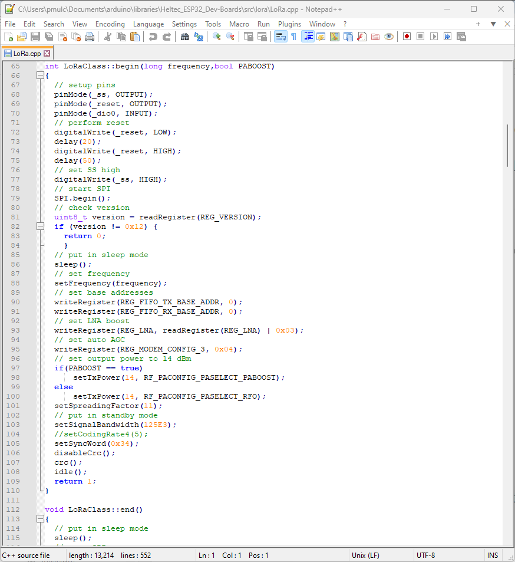

https://notepad-plus-plus.org/downloads/[notepad-plus-plus.org/downloads/]

[[kate, Kate]]
=== Kate
Linux graphical text editor with enhanced features like <<notepad_pp>>.  

.Kate Example`
image::kate.png[]

https://kate-editor.org/[kate-editor.org/]

[[gedit, Gedit]]
=== Gedit
Linux graphical text editor.  This supports basic features, but is still better than MS Wordpad.  

.Gedit Example`
image::gedit.png[]

https://wiki.gnome.org/Apps/Gedit[wiki.gnome.org/Apps/Gedit]

[[nano, Nano]]
=== Nano
Linux terminal text editor.  This editor is an easy to use basic text editor.  This can be used when a graphical environment is not available, and is simple and intuitive to use.  You navigate your text file with the arrow keys, when you are ready to save type [CTRL-O], to exit type [CTRL-X].

.Nano Example`
image::nano.png[]

https://www.nano-editor.org/

[[vi, vi, vim, or gvim]]
=== vi, vim, or gvim
Linux terminal and graphical text editor.  This is a very full featured text editor that has a complex interface.  There are two modes to the environment: command and insert.  Insert mode is entered on a few commands, to exit insert mode and return to command mode use the [ESC] key.  If you find yourself in a vi type environment the following commands will help:

* :w - Write to disk
* :wq - Write and exit
* :q! - Exit NOW without writing
* :i Insert text (change to insert mode)
* :set nu - Turn on line numbers

.Vim Example`
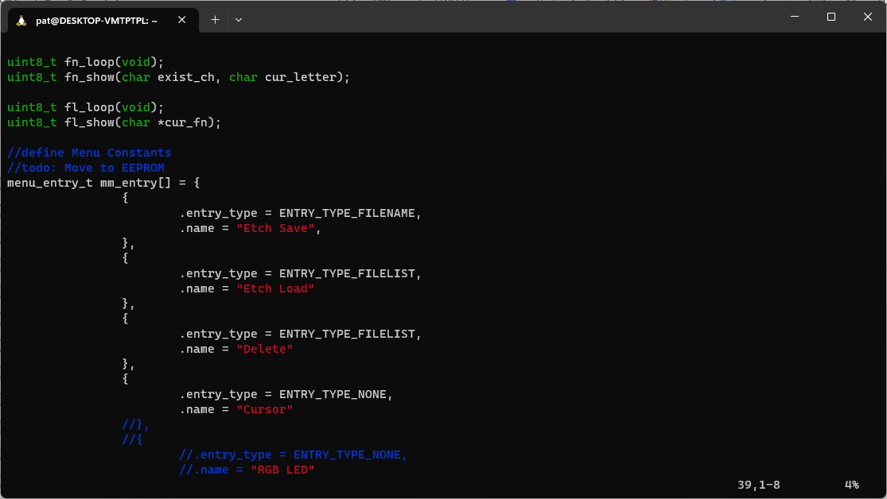

For more look command information here: https://web.mit.edu/merolish/Public/vi-ref.pdf[vi-ref.pdf]

https://www.vim.org/[www.vim.org]

[[eclipse, Eclipse]]
=== Eclipse
Eclipse it an open source development environment that is used be many software disciplines. This integrated environment allows ful software development including lint (syntax checking) and compiling.  There are many language specific perspectives that streamline the environment for specific tasks.  Eclipse uses a workbench that contains projects.  Each project contains all the files used to build your project.  This allows you to organize your source files in an easy to use format; it also allows Eclipse to search only your project.  Each project defines how the code will be processed.  This allows you to create an environment that know how to build you project and can present a debug view of your code.  

.Eclipse Example`
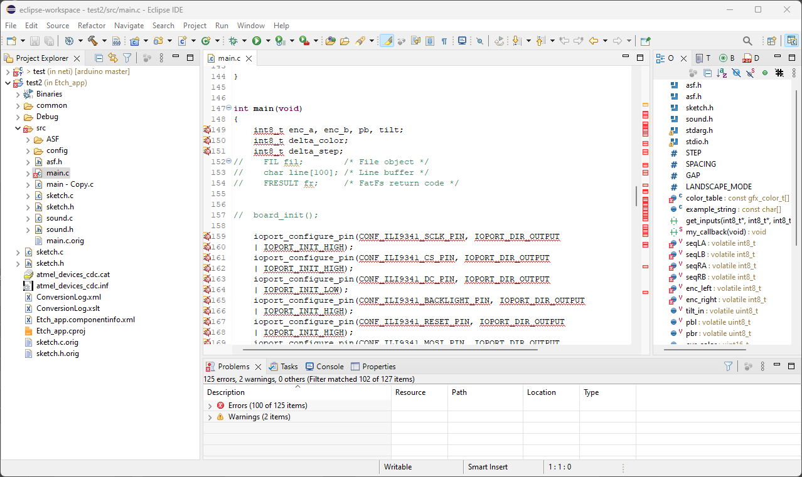

https://www.eclipse.org/ide/[www.eclipse.org/ide/]

https://www.eclipse.org/home/[www.eclipse.org/home/]

[[vscode, Visual Studio Code]]
=== Visual Studio Code
Visual Studio is a free IDE from Microsoft for software development similar to <<eclipse>>.  This editor is well supported with many extensions.  For example I am using the Asciidoctor extension to write this document.  PlatformIO gives you the ability to develop microcontrollers in this nice to use environment.

.Visual Studio Example`
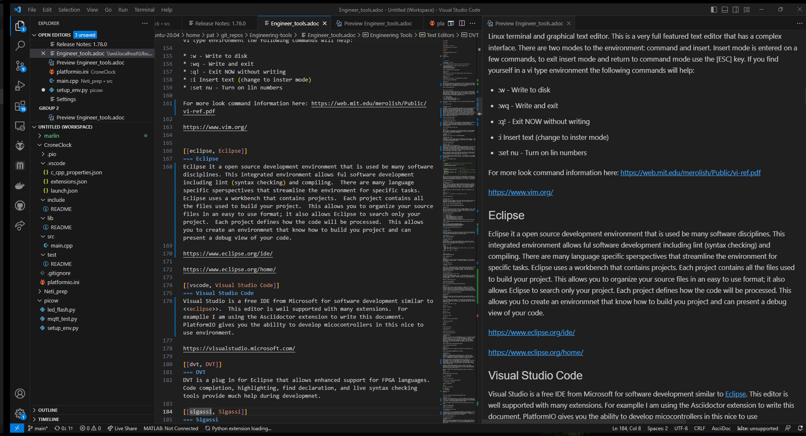

https://visualstudio.microsoft.com/

[[dvt, DVT]]
=== DVT
DVT is a plug in for Eclipse that allows enhanced support for FPGA languages.  Code completion, highlighting, find declaration, and live syntax checking tools provide much help during development.

https://dvteclipse.com/?campaignid=17823859329&gclid=CjwKCAjw5remBhBiEiwAxL2M9yEdUwoyTzHtQNhaZ_S9EXG2yBFdrXClo2PnYL_PgG8Yfl7hDI7lNRoCNz4QAvD_BwE[dvteclipse.com]

[[sigassi, Sigassi]]
=== Sigassi
Sigassi is a tool like <<dvt>> for FPGA development.

https://www.sigasi.com/[www.sigasi.com/]

[[spyder, Spyder IDE]]
=== Spyder IDE
Spyder IDE is a python IDE that helps when developing a Python program.  It has a code editor, python terminal window, a variable viewer and a debugger.  This is included with an Anaconda install.

.Spyder Example
image::spyder.png[]

https://www.spyder-ide.org/[www.spyder-ide.org/]

[[arduino, Arduino IDE]]
=== Arduino IDE
Simple code editor for microcontrollers.
Arduino is a free IDE that works with simple microcontrollers. This is an open source project that was designed to make using microcontrollers easy for children.  Because of this we have a powerful tool that is very easy to use.  Arduino uses a simplified version of c that has two basic functions: setup() and loop() in every sketch.  Setup is run once at the start. Loop runs over and over again after setup is complete.

There is support for most microntrollers and the examples library has almost any type of sensor or device your would want to use.  This is a great way to see something work before incorporating it in your design.  

Code is available for most sensors actuators.  This means there is an example for almost anything you want to do and this is alll availble in the IDE under Examples menu.

Here is a simple example sketch:

[source, c]
----

// the setup function runs once when you press reset or power the board
void setup() {
  // initialize digital pin LED_BUILTIN as an output.
  pinMode(LED_BUILTIN, OUTPUT);
}

// the loop function runs over and over again forever
void loop() {
  digitalWrite(LED_BUILTIN, HIGH);   // turn the LED on (HIGH is the voltage level)
  delay(1000);                       // wait for a second
  digitalWrite(LED_BUILTIN, LOW);    // turn the LED off by making the voltage LOW
  delay(1000);                       // wait for a second
}
----
Here you can see how the setup function sets the pin mode once and the loop function turns on and off the output with a 1 second delay.  This example was copied from the blink example that comes with the environment.  You can find this and many more examples by selecting the *File*-> *Examples* menu choice.

.Arduino Example
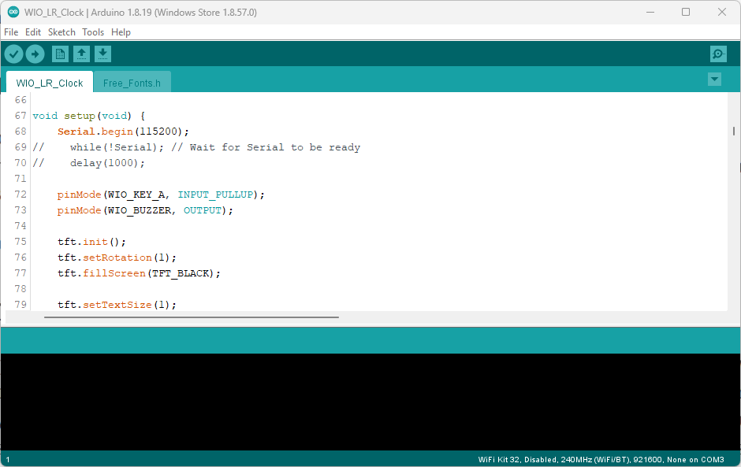

https://www.arduino.cc/[www.arduino.cc/]

[[asciidoc, AsciiDoctor]]
=== AsciiDoctor
This is the tool I would use to create a doctorate level paper or a dynamic website.  This tool takes human readable text with some easy formatting and created nice looking documents.  Since this is easy to read and create text, I can automate the creation without much pain.  So if you have an automated method to collect experiment data, the report can be populated as data is collected.

I used AsciiDoctor to create this document.  Below is the command run to do that:

[source, shell]
----
asciidoctor -r asciidoctor-pdf -b pdf Engineer_tools.adoc
----

https://asciidoctor.org/[asciidoctor.org/]

[[sed_awk, Sed and Awk]]
=== Sed and Awk
Sed and Awk are Linux command line utilities that have spawned into their own simplified scripting languages.  You can use these tools to modify text documents.  This is use in very clever ways.

https://www.gnu.org/software/sed/manual/sed.html[www.gnu.org/software/sed/manual/sed.html]

https://www.gnu.org/software/gawk/manual/gawk.html[www.gnu.org/software/gawk/manual/gawk.html]

[[grep, Grep]]
=== Grep
grep is a tool that will search a file for a "Regular Expression", RE.  An RE is a search pattern protocol that can have advanced attributes.  You can use grep as a find in files by using a * wildcard.  RE are used in many of the text editors and the sed and awk utilities.

Some Useful characters are:

* '^' = Start of line
* '$' = End of line
* '*' = Match preceding RE term 0 or more times
* '+' = Match preceding RE term 1 or more times
* '?' = Match preceding RE term 0 or 1 times
* '{m}' = Match preceding RE term exactly m times
* '[]' = Create a set of characters to match ie. [a-z] will match lowercase letters
* '\' = An escape character to allow proceding special charcters in your search string

https://www.gnu.org/software/grep/manual/grep.html#:~:text=grep%20searches%20the%20named%20input,grep%20searches%20the%20working%20directory%20[www.gnu.org/software/grep/manual/grep.html]

https://www.rexegg.com/regex-quickstart.html[www.rexegg.com/regex-quickstart.html]

== Graphic Tools 

[[draw_io, DrawIO]]
=== DrawIO
This is a simple tool to use that gives the user the ability to create Visio like block diagrams without costs of an expensive tool.  This tool can be run in a browser or can be downloaded to run on your machine.

.DrawIO Example`
image::drawio_example.png[]

https://www.drawio.com/[www.drawio.com/]

[[wavedrom, Wavedrom]]
=== Wavedrom
Wavedrom allow you to create timing diagrams using a simple text protocol.  This is helpful in describing digital interfaces.  This tool can be run in a browser or can be downloaded to run on your machine.

[[source, wavedrom]]
----
{signal: [
  {name: 'clk', wave: 'p.....|...'},
  {name: 'dat', wave: 'x.345x|=.x', data: ['head', 'body', 'tail', 'data']},
  {name: 'req', wave: '0.1..0|1.0'},
  {},
  {name: 'ack', wave: '1.....|01.'}
]}
----

.Wavedorm Example
image::wavedrom_examp.svg[]

https://wavedrom.com/[wavedrom.com/]

[[gimp, Gimp]]
=== Gimp
Image editor tool. Gimp is a powerful bitmap editing tool.  This is like a free version of Adobe Photoshop.  I used gimp to generate the screenshots for this document.

.Gimp Example
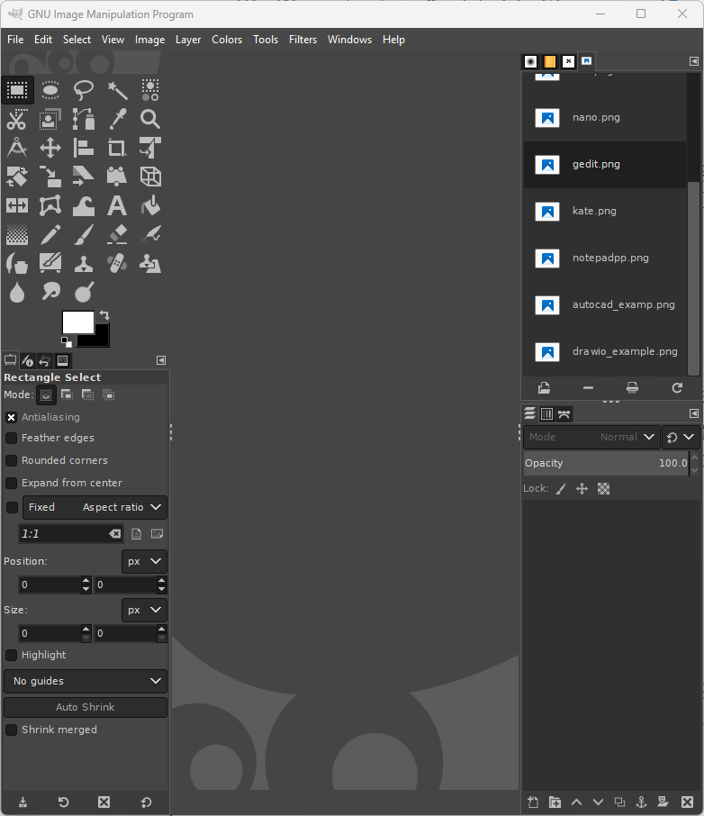

https://www.gimp.org/[www.gimp.org/]

[[inkscape, Inkscape]]
=== Inkscape

Inkscape is a vector graphic editor.  Vector graphics are image files that can scale.  This is because vector graphic files store directions to make a drawing verses the value of every pixel (bitmap).  This format was derived from instructions to print a drawing on a plotter.  PDF file format is an example of a vector file.

https://inkscape.org/[inkscape.org/]

[[autocad_fusion, Autocad Fusion 360]]
=== Autocad Fusion 360
Free tool to create 3-D drawings.  This is an extremely powerful tool that can be used to create 3-dimensional drawings.  You can create 2-D sketches and extrude to make a 3-d object.  This is very useful in creating things to print on a 3-D printer.

Requires a free account to use.

.Autocad Fusion 360 Example
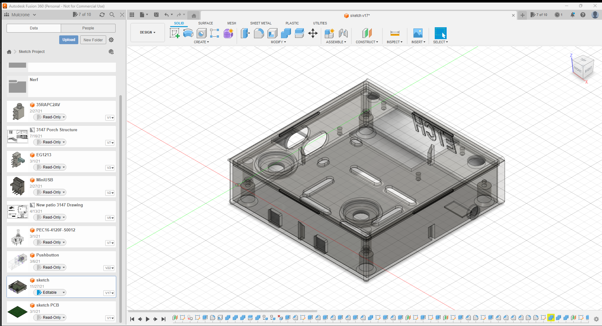

https://www.autodesk.com/products/fusion-360/overview[www.autodesk.com/products/fusion-360/overview]

[[cura, Cura]]
=== Cura
Open source Slicer tool to create G-code that is needed for 3-D printer.  G-code is a text file that contains commands for a 3-D printer.  This tool converts a drawing ie *.stl file to the commands your printer needs to make it.  This tool should have knowledge of your printer and the material you are printing.  There is an opportunity to tweak settings here to get a better print.

https://ultimaker.com/software/ultimaker-cura/[ultimaker.com/software/ultimaker-cura/]

== Source Control 
[[git, Git]]
=== Git
Source control tools that allow you to go back in time and allow parallel development.  These tools are a lifesaver for projects that last for more than a few weeks. 

Git is the popular tool this week.  For most open source software the code is available in a public git repository.  For simple one person projects you can create a local repo that will provide the time machine function that can save significant work.

To create a local copy of a repo:

[source, git]
----
git clone [repo URL]

git clone git@github.com:pat-fpga/Engineering-tools.git
----

To add to a repo; this allows you to update the repo with your changes:

[source, git]
----
git add [filename]
----

To commit to a repo; this creates a commit id on your local repo:

[source, git]
----
git commit -m [your commit comment]
----

To publish your commits; this copies your local commit points to the public repo:

[source, git]
----
git push
----

https://git-scm.com/[git-scm.com/]

[[svn, Subversion]]
=== Subversion

Subversion is similar to git.  Previous to <<git>> this was my preferred version tool since it was easy to set up and use.

https://subversion.apache.org/[subversion.apache.org/]

== Compare tools 
[[kdiff3, Kdiff3]]
=== Kdiff3
Kdiff3 is a tool that works in both Windows and Linux.  It is handy to be able to compare two files.  It is key to understand version in a version control system like <<git>> or <<svn>>.  This can help highlight changes to a file after it is copied before any alterations.  This tool also can compare directories.  If you want you can merge the changes in the files together.  This tool lest you go to each difference and decide if you want A, B or a custom change.

.Kdiff3 Example
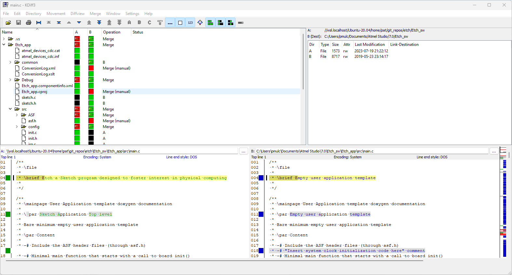 

https://download.kde.org/stable/kdiff3/?C=M;O=D[download.kde.org/stable/kdiff3]

https://invent.kde.org/sdk/kdiff3[invent.kde.org/sdk/kdiff3]

[[meld, Meld]]
=== Meld
Meld is a gnu open source compare tool with many of the same features as <<kdiff3>>.  

.Meld example
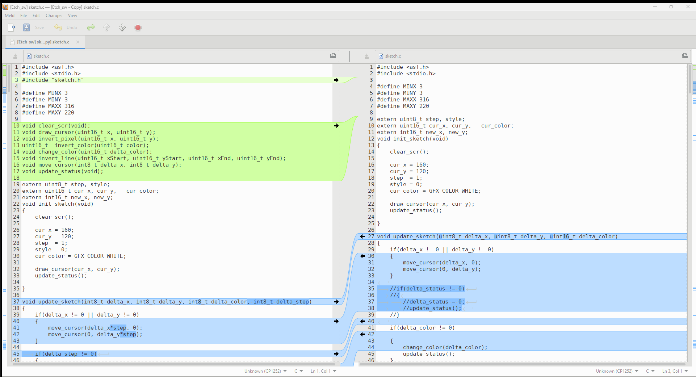

https://gitlab.gnome.org/GNOME/meld/-/tree/main/[gitlab.gnome.org/GNOME/meld/]

== Math Tools 
[[matlab, Matlab]]
=== Matlab
Matlab is an extremely powerful math modeling tool.  It has very nice libraries of advanced functions that can easily be called from a Matlab script.  Although Matlab is prohibitively expensive for me to use outside of work it is available for purchase as a student at a reasonable rate. 

Matlab likes to work on arrays and matrices; where a matrix is a multidimensional array.  Matlab defaults to a C double datatype for floating point numbers.  The scripts that Matlab likes are called M-Files.  All commands that can be run in the terminal can be used in an M-File scripts.  This combined with normal scripting constructs like conditionals and loops creates a powerful tool.  

Matlab has really good graphing that is easy to create.  This helps tremendously when trying to visualize data.  It also is easy to import and export data to files.  Matlab has Toolboxes that contain advanced functions that can be called from your scripts.

Below is a sample M-File script that demonstrates some of the features in Matlab.

[source, Matlab]
----
%Create Simple array of know values

a = [ 1,10,100,1000]

%Create a 3x3 array

b = [1,2,3; 4,5,6; 7,8,9]

%Create an array of evenly spaced interval

c = linspace(0, 8*3.1415927)

%Create a simple plot 

plot(a)

%Do some fun array math

d = 500*cos(c)
e = c/3.1415927

%add to the plot
plot(e,d)

----

https://www.mathworks.com/products/matlab/student.html[www.mathworks.com/products/matlab/student.html]

[[scilab, SciLab]]
=== SciLab
Scilab is a free Matlab like tool.  This has the same basic functionality as <<matlab>>, but is missing the advance function libraries that are available in <<matlab>>.  So most simple Matlab scripts will just run in this tool after a conversion with the mfile2sci(path_to_M-File) command.

Here is the graphics output from the M-File script listed in the <<matlab>> section.

.SciLab M-file demo graph
image::sci_lab_graph.png[]

https://www.scilab.org/[www.scilab.org/]

[[wolframalpha, Wolfram Alpha]]
=== Wolfram Alpha

A website that can solve challenging math problems with explanations.  This is an amazing tool that you can ask wonky questions and it will generate an accurate response more often than not (for math problems).  I like this tool because it shows the steps used to get to an answer.

.WolframAlpha Example
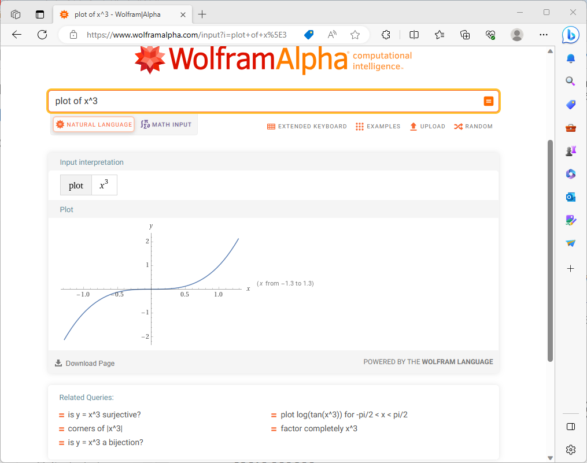

https://www.wolframalpha.com/[www.wolframalpha.com/]

== Programming Languages 
[[python, Python]]
=== Python
Python is a scripting language meaning the text to machine code conversion happens when you run the program.  It is a loosely typed language; this means you can define a variable and it will figure out the datatype by what you assign to it

[source, python]
----
my_int = 10
my_float = 10.5
my_string = "This is my string of characters'
my_char = 'a'
my_int_list = [10, 20, 30, 40]
----

Here is an example that shows a complex function easily done in python.  This program will find a NPT server on the internet and get accurate time to print

[source, python]
----
#!/usr/bin/env python
from socket import AF_INET, SOCK_DGRAM
import sys
import socket
import struct, time
 
def getNTPTime(host = "pool.ntp.org"):
        port = 123
        buf = 1024
        address = (host,port)
        msg = '\x1b' + 47 * '\0'
 
        # reference time (in seconds since 1900-01-01 00:00:00)
        TIME1970 = 2208988800 # 1970-01-01 00:00:00
 
        # connect to server
        client = socket.socket( AF_INET, SOCK_DGRAM)
        client.sendto(msg.encode('utf-8'), address)
        msg, address = client.recvfrom( buf )
 
        t = struct.unpack( "!12I", msg )[10]
        t -= TIME1970
        return time.ctime(t).replace("  "," ")
 
if __name__ == "__main__":
        print(getNTPTime())
----
Python is capable of object oriented programming.  This allows you to assign functions to a data type.  Lets say you have an integer that is a distance; you can use a class to treat this as a radius that has a functions that return the circumference, area, and volume.  This class can be used to inherit those functions to define a class that calculates the weight of a sphere of iron.  This allows significant code reuse in ways that are not obvious at the start.

The main strength of Python is the code base that is contained in open source libraries.  This means you can do very complex things with very little code since you only have to call the functions someone else has written.  Python with a few libraries (numpy, matplotlib) allow manipulation an graphing at a level on par with Matlab.  The libraries allow python to talk internet protocols and can talk to hardware interfaces without much effort.  There is also significant support for Artificial Intelligence in python.  

Python has a package manager to install the libraries you require called *pip*.  sometimes you will need to force it to update the python3 install with the *pip3* command

https://www.python.org/[www.python.org/]

Anaconda is a packaged version of Python that will help setup your environment. This includes helpful libraries for math and science. 

https://www.anaconda.com/[www.anaconda.com/]

Python has even been ported to many 32bit microcontrollers and is gaining support in the Arduino ecosystem:

https://micropython.org/[micropython.org/]

https://circuitpython.org/[circuitpython.org/]

[[cpp, C or C++]]
== C or C++
C is a basic language that is much closer to assembly language than <<python>>.  This usually means the execution will be faster when your app is developed in C.  C is the base language that defines most of the syntax used.  C++ is an extension that allows object oriented programming through classes that can be inherited from.  <<arduino>> uses a subset of c that is easier for beginners.  In non <<arduino>> apps the entry point is a function called main. 

Here is a table of basic datatypes in C.  Here I give the explicit names of the types instead of the general forms like int, short, long, longlong...

[[C_TYPES]]
.Datatypes in C/C++
[%autowidth]
|===
|Datatype |Size |Notes

|char
|1 Byte
|Ascii coded character: https://www.ascii-code.com/

|int8_t
|1 Byte
|Signed byte value capable of storing an integer in the range of [-128 - 127]

|uint8_t
|1 Byte
|Unsigned byte value capable of storing an integer in the range of [0 - 255]

|int16_t
|2 Btyes
|Signed integer capable of storing an integer in the range [-32,768 - 32,767]

|uint16_t
|2 Bytes
|Unsigned integer capable of storing an integer in the range [0 - 65,535]

|int32_t
|4 Btyes
|Signed integer capable of storing an integer in the range [-2,147,483,648 - 2,147,483,647]

|uint32_t
|4 Bytes
|Unsigned integer capable of storing an integer in the range [0 - 4,294,967,295]

|float	
|4 byte	
|Floating point number in the range [1.2E-38 to 3.4E+38] with 6 decimal places of precision.  Here we have 1 bit for sign, 8 bits for exponent, and 23 bits for mantissa.

|double	
|8 byte	
|Floating point number in the range [2.3E-308 to 1.7E+308] with 6	15 decimal places of precision.  Here we have 1 bit for sign, 11 bits for exponent, and 52 bits for mantissa.

|long double	
|10 byte	
|Floating point number in the range [3.4E-4932 to 1.1E+4932] with 6	19 decimal places of precision.  Here we have 1 bit for sign, 15 bits for exponent, and 112 bits for mantissa.

|===

Floating point numbers are special and there are a few things that should be known.  Floating point numbers in C are in a defined standard from IEEE: IEEE-754.  This define the Most significant bit as the sign bit, Then there is an exponent, and a mantissa.  The mantissa is a fractional number less than or equal to 1 (without the leading 1); the length of the mantissa determines the precision.  The expoont part can specify a positive of negative exponent of base 2; the exponent determines the range of the floating point number.  Since floating point numbers can have uncertainty, care must be used in comparisons.  I would avoid absolute comparisons A == 3.14159 since this test can fail because of a rounding error.  If you need an 'equal' comparison, I would limit the precision of the thing I am comparing and then round the float to the expect precision that is less than the float precision with a known rounding algorithm.

Complex datatypes are available in C/C+\+. These include arrays, character strings, structures, unions, and classes.  Arrays are a list of the datatype the array is defined with.  Arrays elements can be addressed by using an index to point to the element of interest.  Character strings are essentially arrays of characters elements that are terminated by a NULL character, 0x00.  This allows the programmer to allocate a maximum space, but only use a subset of that space for the string data when it is shorter than the maximum.  Structures allows a grouping of many types of data together.  This is helpful if there is a relation between the different data elements stored in a struct.  Unions are similar to a structure except that all elements share the same memory.  This ais a clever way that a single memory location to be treated as an integer byte or a character byte in your program.  Classes were added to allow C++ object orianted design.  They can be thought of as a structure with the addition of functions that use the data.  

One of the major strengths of C/C++ is the ability to use pointers.  Pointers are variables that point to a place in system memory. Pointers have a datatype associated with it to tell the compiler how to treat the memory element.  Pointers are declared much like regular variables only pointers have a '*' character before the variable name.  Extreme care must be used when working with pointers.  

The primary compiler for C/C++ programs is the GNU GCC compiler.  This is open source and has been ported to nearly every platform you will find.  Microsoft has their own compiler in Visual Studio and there are others like Kiel.

The following example asks for the number of terms and then calculates and prints that number of fibincci terms.  
[source, c]
----
#include <stdio.h>
int main() {

  int i, n;

  // initialize first and second terms
  int t1 = 0, t2 = 1;

  // initialize the next term (3rd term)
  int nextTerm = t1 + t2;

  // get no. of terms from user
  printf("Enter the number of terms: ");
  scanf("%d", &n);

  // print the first two terms t1 and t2
  printf("Fibonacci Series: %d, %d, ", t1, t2);

  // print 3rd to nth terms
  for (i = 3; i <= n; ++i) {
    printf("%d, ", nextTerm);
    t1 = t2;
    t2 = nextTerm;
    nextTerm = t1 + t2;
  }

  return 0;
}
----

https://gcc.gnu.org/[gcc.gnu.org/]

https://www.keil.com/[www.keil.com/]

[[ruby, Ruby]]
=== Ruby
Ruby is a popular language for web facing applications.  Asciidoctor was written in it.

https://www.ruby-lang.org/en/[www.ruby-lang.org]

[[tcl, Tcl]]
=== Tcl
Tcl (pronounced tickle) is a simple scripting language that had very loose licensing that allowed many companies to incorporate it into their tools.  I see this in almost all of the FPGA tools that I use.  

https://www.tcl.tk/about/language.html[www.tcl.tk]

[[bash,Linux Shell]]
=== Linux Shell
The Linux shell is the command promt in Linux.  There are many varieties of shell including  bash, dash, and c shell.  Bash is the default in most Linux systems except Ubuntu since that uses dash.  C shell has some c like commands built into the prompt that make some tasks easier.  Some basic Linux commands are:

* pwd -> print path of current directory
* ls -> list the files in the current directory
* alias -> create a macro ie *alias ll='ls -l'*
* cat -> prints the contents of a file
* less -> interactively prints the content of a file (allow keys navigate)
* cd -> change directory
* mkdir -> make directory
* cp -> copy a file
* mv -> move a file
* ln - s -> create a symbolic link to a file
 
Many Linux utilities take a file or stream in and output one or more streams.  This allows piping on programs output to another program.  Some special characters to pipe are:

* | connect a program's output to another program's input.  Use this cmd1 [args] | cmd2 [args]
* > redirect output to a file
* >> redirect output to an appended file
* tee This allows you to do more than one operation on the output of a program

https://www.gnu.org/software/bash/[www.gnu.org/software/bash/]

https://wiki.archlinux.org/title/Dash[wiki.archlinux.org/title/Dash]

== Communication Tools
[[ssh, SSH]]
=== SSH
This is an amazing tool to communicate between devices.  This tool has two parts, a server and a client.  The server runs on the machine you connect to, and the client is the tool you use to connect.  Once a connection is made you are presented with a prompt from the remote device;  this allows remote control of devices.  Graphics can be forwarded through the SSH tunnel if you enable that feature.  The best part of SSH is the level of security it can provide.

SSH can be set up to avoid using passwords by using asymetric keys.  This prevents the need for a password.

https://www.openssh.com/[www.openssh.com/]

[[putty, PuTTY]]
=== PuTTY
Putty is a serial terminal for windows. This tool allows you to save sessions and easily connect later.  Supports serial and ssh connections. Please note that this tool does support SSH keys, but it stores the keys in a different format.

.Putty Example
image::putty.png[]

https://www.putty.org/[www.putty.org/]

[[minicom, Minicom]]
=== Minicom
a Linux serial terminal program.  To start *minicom -s* will start with a menu to configure the port.  In Linux the serial ports are found in /dev/tty*.

https://help.ubuntu.com/community/Minicom[help.ubuntu.com/community/Minicom]

[[vnc, Virtual Network Computing, VNC]]
=== Virtual Network Computing, VNC
VNC allows a remote graphical connection.  The VNC protocol compresses the graphical content so the latency is improved even if the connection is slow.  This tool allows you run a computer remotely even though the interface is graphical.

https://www.tightvnc.com/[www.tightvnc.com/]

[[rdp, Remote Desktop Protocol]]
=== Remote Desktop Protocol
Remote desktop protocol is a Windows supported method for remote control similar to <<vnc>>.  Now Linux distributions are adding support for this protol.

https://learn.microsoft.com/en-us/troubleshoot/windows-server/remote/understanding-remote-desktop-protocol[learn.microsoft.com/...understanding-remote-desktop-protocol]

[[wireshark, Wirshark]]
=== Wireshark
This tool allows you to capture packets and filter them.  This is very handy to investigate network traffic.  This supports both wired and WiFi connections along with Bluetooth.

https://www.wireshark.org/[www.wireshark.org/]

== Circuit Design 
[[kicad, Kicad]]
=== Kicad
Kicad is an open source schematic capture and layout tool for printed circuit boards. This is a free tool that allows you to design a printed circuit board.  You can add new parts to the library and model them both in the schematic and in the layout.  This means create a picture for the schematic and a footprint for the layout.  The gerber outputs from this tool are acceptable to circuit board fabrication companies.  The cost of creating a PCB has come down to ~$1.00 per board making this tool useful.

.Kicad example
image::kicad.png[]

https://www.kicad.org/[www.kicad.org/]

== FPGA Tools 
FPGA are field programmable Gate arrays.  These programmable devices allow you to create custom logic circuits that can be changed just by loading a new bitfile.  FPGA's use LookUp Tables or LUT's to implement logic.  Other logic element commonly available in FPGA's are:
* Blockram
* Hard Multipliers
* PCIE interfaces
* Hard processor cores
* ...

[[excelium, Excellium Logic Simulator]]
=== Excellium Logic Simulator
Excelium is a FPGA simultor from Cadence.  This tool allows you to fully see how a FPGA design in a way that is not available once the FPGA runs in hardware.

https://www.cadence.com/en_US/home/tools/system-design-and-verification/simulation-and-testbench-verification/xcelium-simulator.html[www.cadence.com/.../xcelium-simulator.html]

[[modelsim, Modelsim]]
=== Modelsim
Modelsim is a FPGA simulator with features similar to <<excelium>>.  This is the most popular tool.

https://eda.sw.siemens.com/en-US/ic/modelsim/[eda.sw.siemens.com/en-US/ic/modelsim/]

[[aldec, Aldec]]
=== Aldec
Aldec is a simulator/editor environment from a smaller company.  I like this tool because I have found it to adhere to the language standard better than other tools.

https://www.aldec.com/en[www.aldec.com]

[[synplfy, Synplify Pro]]
=== Synplify Pro
Synplify Pro is a synthesis tool that can take the text of FPGA code and map it to the basic hardware components like LUTs, registers, and blockram.  

https://www.synopsys.com/implementation-and-signoff/fpga-based-design/synplify.html[www.synopsys.com/.../synplify.html]

[[vivado, Vivado]]
=== Vivado
Vivado is the Xilinx tool to create a bitfile for Xilinx parts.  This tool comes with an editor, simulator, block diagram editor, and tools to create FPGA bitfiles.  The bitfile is the file that gets loaded.

https://www.xilinx.com/products/design-tools/vivado.html[www.xilinx.com/.../vivado.html]

[[libero, Libero]]
=== Libero
Libero is the vendor tool for Microsemi/Microchip parts.  This tool is trying to be like Vivado. 

https://www.microchip.com/en-us/products/fpgas-and-plds/fpga-and-soc-design-tools/fpga/libero-software-later-versions[www.microchip.com/.../libero-software]

== Audio Tools
[[audacity, Audacity]]
=== Audacity
Audacity is a visual audio editor.  It contains audio filters that are handy.  I like to normalize audio from different sources to have a uniform volume.

.Audacity Screenshot
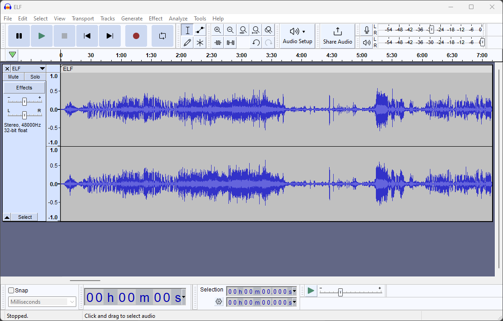

https://www.audacityteam.org/[www.audacityteam.org/]

== Virtualization 
[[virtualbox, VirtualBox]]
=== VirtualBox

Oracle Virtualbox will allow you to run a virtual system without exiting your main OS.  These tools allow sharing of development environments since the entire environment can be saved as a file.  Gross version control can be had by saving snapshots of your environment.  You can configure this tool to share resources from the host OS.  This includes a virtual disk drive that you can create.  

https://www.virtualbox.org/[www.virtualbox.org/]

[[docker, Docker]]
=== Docker
Docker is a lightweight virtual environment since it uses the host kernel for low level operations.  Many companies are providing docker containers.  This allows full control of the environment.  There is a penalty to any virtual environment in performance.  I also feel like I am managing more and more environments due to docker.

https://www.docker.com/[www.docker.com/]

[[WSL, Windows Subsystem for Linx, WSL]]
=== Windows Subsystem for Linx, WSL
Starting in Windows 11, an option was added to Window OS that allows you to run Ubuntu in a virtual machine that was part of windows.  This is called WSL (Windows Subsystem for Linux).  Although this is not a full Linux environment, it does allow you to do most Linux things without booting in Linux.  Now even graphical programs are supported.  <<ubuntu>> is supported.

https://learn.microsoft.com/en-us/windows/wsl/about[https://learn.microsoft.com/.../windows/wsl]

== Operating Systems
[[windows, Microsoft Windows]]
=== Microsoft Windows
Microdoft Windows is the default operating system for most Personal Computers.  Therefore you are probably familiar with it.

Microsoft has also updated their shell command prompt to somthing called powershell.  This will allow more Linux-like commands.
https://www.microsoft.com/en-us/windows?r=1[https://www.microsoft.com/.../windows]

[[ubuntu, Ubuntu Linux]]
=== Ubuntu Linux
Popular Linux distribution with community support for non expert users.  Many development environments force you to use Linux.  The default desktop is similar to Windows where there is a menu to select what program you want to run. 

For terminal operations, I like using a program called byobu.  Other similar programs are GNU screen and tmux.  These tools allow you to switch between multiple terminal sessions and keep the sessions active even after I loose connection.  This is why I use these tools when I am remoting in over an SSH connection.  The <<bash>> section has information of what to type in a terminal session.

https://www.byobu.org/[www.byobu.org/]

https://ubuntu.com/[ubuntu.com/]

== Security

[[bitwarden, Bitwarden]]
=== Bitwarden

Bitwarden is an open source tool that can save your passwords.  You will find that you end up having passwords for too many things to keep track of.  I like this tool since it is cross platform and far more secure than a browser or phone OS.

https://bitwarden.com/[bitwarden.com/]

== Protocols
=== File Protocols
[[xml,XML]]
==== XML
XML = Extensible Markup Language.  This filetype is used in many applications like MS Word.  I do not like directly editting these files as text because it has too many human unreadable elements.

https://www.w3schools.com/xml/xml_whatis.asp[www.w3schools.com/xml/xml_whatis.asp]

[[html, HTML]]
==== HTML
Hypertext Markup Language is used to create basic webpages.

https://www.geeksforgeeks.org/html/[www.geeksforgeeks.org/html/#]

[[yaml,YAML]]
==== YAML

YAML is a human readable file format that can be used for configurations.  It is based off of XML that Microsoft uses for many application files.  I like the ease of creating and the complex data structures that are created from the contents of this type of file.  My one complaint is that it uses invisible characters (spaces) in its interpretation of the file.

https://yaml.org/[yaml.org/]

=== Internet Protocols
A good and somewhat entertaining resource to learn about internet protocols would be the Security Now podcast.  

https://twit.tv/shows/security-now?gclid=CjwKCAjw5remBhBiEiwAxL2M96iXpbqcb59hvMmC3HMRUYrMsajim-PcvsDqrDyorQ9_9IqLbhdhdBoCbnkQAvD_BwE[twit.tv/shows/security-now]

[[ip,IP]]
==== IP
IP or Internet Protocol is the backbone of the internet.  There are two flavors of this in the wild today, IPv4 and IPv6.  The difference between these is the length of the address of endpoints.  This protocol allows routing of messages throughout the internet.

https://usa.kaspersky.com/resource-center/definitions/what-is-an-ip-address[usa.kaspersky.com/.../what-is-an-ip-address]

[[tcp,TCP]]
==== TCP
TCP stands for Transmission Control Protocol.  This is the main protocol used in browsing the internet.  This protocol can guarantee reception of a packet.  This feature adds lots of overhead to give the user all the data requested.

https://en.wikipedia.org/wiki/Transmission_Control_Protocol[en.wikipedia.org/wiki/Transmission_Control_Protocol]

[[udp,UDP]]
==== UDP
UDP stands for User Datagram Protocol.  This is used for internet traffic that has higher data throughput requirements.  This is because the requirement for data reception is not present.  Therefore this is used for many streaming applications.

https://en.wikipedia.org/wiki/User_Datagram_Protocol[en.wikipedia.org/wiki/User_Datagram_Protocol]

[[mqqt,MQTT]]
==== MQTT

MQQT is a simple internet protocol like <<tcp>>.  The benefit of MQTT is that simple microntrollers have good libraries to talk this protocol.  So you can have a tiny ESP32 like microcontroller that can read a temperature sensor and have it broadcast it over WIFI to redundant data logging computers.  This means you can automate lab tests in a way that can scale up with the complexity.  The protocol has many of the same features as tcp like packet resend with a simpler broker as a master.

There are apps for your phone that can talk this protocol.  Plus languages like python have extensive libraries to support this protocol.  This has to be the easiest way to create a network of microcontrollers that talk to each other.

https://mqtt.org/[mqtt.org/]

[[dns,Domain Name Server]]
==== Domain Name Server

This is what your browser uses to find an internet address for a human readable address (ie. www.google.com => 143.244.220.150).  There are clever tricks that can be used with this tool.  Your computer ussually assumes it is the first DNS server it will check.  That means you can assign addresses to named entities just by editing a simple hosts file.

https://www.cloudflare.com/learning/dns/what-is-dns/[www.cloudflare.com/learning/dns/what-is-dns/]

[[arp, ARP]]
==== ARP

Address Resolution Protocol is the protocol your network uses to determine what is connected.  These low level packets are sent out periodically to see if new devices are connected to the network.  Each networked device has a 48 bit MAC address that is usually assigned by the manufacturer.  This MAC address is sent as a response to an ARP request.  

https://www.fortinet.com/resources/cyberglossary/what-is-arp#:~:text=Address%20Resolution%20Protocol%20(ARP)%20is,%2Darea%20network%20(LAN).[fortinet.com/.../what-is-arp]

[[dhcp,DHCP]]
==== DHCP
Dynamic Host Configuration Protocol allows a router to assign addresses to devices as they are discovered.  This is used instead of static adressing that requires the user to assign unique addresses to each device.

https://learn.microsoft.com/en-us/windows-server/networking/technologies/dhcp/dhcp-top[learn.microsoft.com/.../dhcp]

[[nat, NAT]]
==== NAT
Network Address Translation is the protocol your router uses to enable local addresses for your network.  This allowed IPv4 to exist for significantly longer than expected.  The added security from NAT routing is significant.  This prevents most unsolicited traffic on your local network since the translation table creation requires a local computer requests. 

https://www.geeksforgeeks.org/network-address-translation-nat/#[www.geeksforgeeks.org/network-address-translation-nat]

=== Serial Protocols

[[uart, UART]]
==== UART
A Universal asynchronous Receiver/Transmitter is the protocol for the serial port on old computers.  This protocol can run on 2 wires for RX and TX and allows device to device bidirectional communication.  Because it is asynchronous the RX side needs to detect edges to recover the data; this requires both the RX and TX sides to be running at the same rate or baud.  Other control signals that allow flow control are allowed, but not always supported.  This is the original debug interface.

This protocol only defines how data is transmitted and received, I like the idea of using a packet type protocol on top of this like <<cobs>>.

https://www.analog.com/en/analog-dialogue/articles/uart-a-hardware-communication-protocol.html[www.analog.com/.../uart-a-hardware-communication-protocol.html]

[[spi, SPI]]
==== SPI
Serial Peripheral Interface (SPI) is a four wire bus that allows two devices to communicate.  This is a synchronous protocol so both devices share a clock.  You can reuse three of the four wires by creating a chip select for each device.  The SPI protocol specifies 4 modes of operation:

[[SPI_MODES]]
.Datatypes in C/C++
[%autowidth]
|===
|Mode |CPOL |CPHA

|0 | 0 | 0

|1 | 0 | 1

|2 | 1 | 0

|3 | 1 | 1
|===

These modes effect the timing of the capture. CPOL stands for Clock POLarity and CPHA stands for Clock PHAsa.  The timing diagrams below show the modes clearly:

.SPI Mode 0 (Clock low, sample on positive edge)
image::spi_mode0.png[]

.SPI Mode 1 (Clock low, sample on negative edge)
image::spi_mode1.png[]

.SPI Mode 2 (Clock high, sample on positive edge)
image::spi_mode2.png[]

.SPI Mode 3 (Clock high, sample on negative edge)
image::spi_mode3.png[]

https://www.circuitbasics.com/basics-of-the-spi-communication-protocol/[www.circuitbasics.com/basics-of-the-spi-communication-protocol/]

[[i2c,I2C]]
==== I2C
The Inter Integrated Circuit protocol is a daisy chained 2 wire bus that can connect to many controllers and many peripherals.  Each device has an address (sometimes set by pull ups/downs on pins)  This address is transmitted as part of each message.

https://learn.sparkfun.com/tutorials/i2c/all[learn.sparkfun.com/tutorials/i2c]

[[cobs, Consistent Overhead Byte Stuffing]]
==== Consistent Overhead Byte Stuffing

Consistent Overhead Byte Stuffing can be used in serial communications to detect packet boundaries.  This allows you to know hen a message starts and ends.  The message is altered by replacing all 0x00 bytes with a count to the next 0x00.  The message will alway end with a 0x00 signifying the end of packet.

Simple prsing can remove the counts and return those bytes to 0x00 when the data is recieved.

https://en.wikipedia.org/wiki/Consistent_Overhead_Byte_Stuffing[en.wikipedia.org/wiki/Consistent_Overhead_Byte_Stuffing]

== Microcontrollers

[[atmel, Atmel]]
=== Atmel
Ateml (now Microchip) makes a very popular line of 8 bit microcontrollers.  Atmel AVR chips were used in the original <<arduino>> Boards.  Because of this there is an extensive library of examples that work on these chips.  Microchip purchased Atmel and combined the AVR line with their PIC controllers.

https://www.microchip.com/en-us/products/microcontrollers-and-microprocessors/8-bit-mcus[www.microchip.com/en-us/products/microcontrollers-and-microprocessors/8-bit-mcus]

[[ti430,TI 430]]

=== TI 430
Texas Instruments created this line of products and marketed a rocket development kit that they sold for $4.30.

https://www.ti.com/microcontrollers-mcus-processors/msp430-microcontrollers/overview.html[www.ti.com/microcontrollers-mcus-processors/msp430-microcontrollers/overview.html]

[[esp, Expressif]]
=== Expressif
Expressif name for itself by selling their first WIFI Capable 32 bit microcontroller for ~$2.00; this was the ESP2688. Since then they have created a line of microcontrollers caleed ESP32 that support both WIFI and Bluetooth.  The ESP32 development boards are my goto for remote microcontrollers.  Both <<arduino>> and <<vscode>> support cross compiling for these boards.

https://www.espressif.com/en/products/socs[www.espressif.com/en/products/socs]

https://www.amazon.com/HiLetgo-Display-Bluetooth-Internet-Development/dp/B07X1W16QS/ref=sr_1_72?crid=HV0K1X8WF90C&keywords=esp32&qid=1690424599&sprefix=esp32+%2Caps%2C216&sr=8-72[www.amazon.com/HiLetgo-Display-Bluetooth-Internet-Development]

[[beagle, Beagle Board]]
=== Beagle Board
This single board computer was a phone development platorm based on the TI OMAP processor.  One really nice feature of the OMAP processor is the addition of 2 coprocessors that can control IO's for real time processing at 100MHz.  There are a few versions of this.

https://www.beagleboard.org/[www.beagleboard.org/]

[[rpi, Raspberry Pi]]
=== Raspberry Pi
This board was a full featured Linux computer that you can get for $25.  This now comes in many flavors from a small compute module that goes for a whopping $5.00 or newer models with more memory that cost more.  

https://www.raspberrypi.com/[www.raspberrypi.com/]

[[rpico, Raspberry Pico]]
=== Raspberry Pico
This is a simple microncontroller from the <<rpi>> folks.  This part has programmable logic that can implement different IO standards on the pins of this device.  No WIFI on the original part.

https://www.raspberrypi.com/products/raspberry-pi-pico/[www.raspberrypi.com/products/raspberry-pi-pico/]